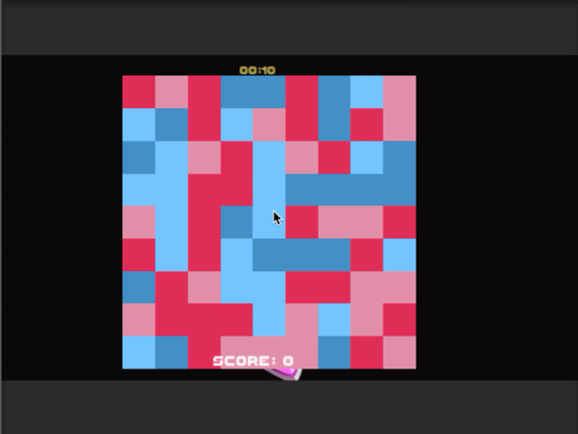

# Tritan Fighter
## Description
This is a special color mining game designed for people with blue-color recognition weakness.

## File Structure (New Unity Project/Assets/Scenes)
- 📂 __Scenes__
   - 📄 [SampleScene.unity]
   - 📄 [SampleScene.unity.meta]
   - 📂 __Scripts__
     - 📄 [ColorGenerator.cs]
     - 📄 [ColorGenerator.cs.meta]
     - 📄 [GemSpawn.cs]
     - 📄 [GemSpawn.cs.meta]
     - 📄 [ResumeController.cs]
     - 📄 [ResumeController.cs.meta]
     - 📄 [ScoreRecorder.cs]
     - 📄 [ScoreRecorder.cs.meta]
     - 📄 [SquareGenerator.cs]
     - 📄 [SquareGenerator.cs.meta]
     - 📄 [SquareVanisher.cs]
     - 📄 [SquareVanisher.cs.meta]
     - 📄 [Timer.cs]
     - 📄 [Timer.cs.meta]
     - 📄 [VisualizeArea.cs]
     - 📄 [VisualizeArea.cs.meta]
   - 📄 [Scripts.meta]
   - 📂 __dinos__
   - 📄 [dinos.meta]

## Technologies
- Unity, C#

## Core Features
- **SquareGenerator.cs, ColorGenerator.cs** - The grid is filled with four different colors: light blue, light pink, dark blue and dark pink.
- **SquareVanisher.cs** - Clicking on a square/patch will make itself disappear and so do its neighbours having the same color. These neighbours are detected through a DFS traversal algorithm.
- **SquareVanisher.cs** - In the mean time, the neighbours with different colors will change their current color to one of the other three colors randomly.
- **ScoreRecorder.cs, GemSpawn.cs** - The more squares you remove, the more points you get. AND you will finally reveal the gems beneath it.
- **Timer.cs** - However, a timer is added to make the game more tense, yet more fun as a nature of games.

## Demo
Here is a quick demo of how it works:

